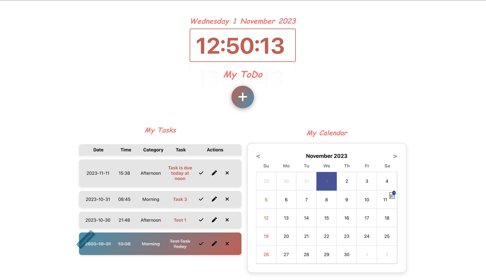
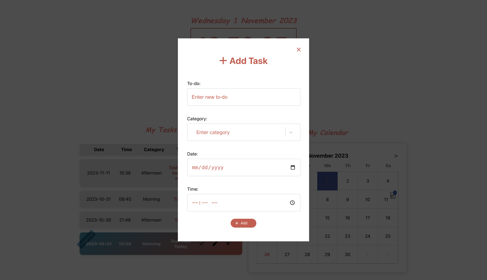
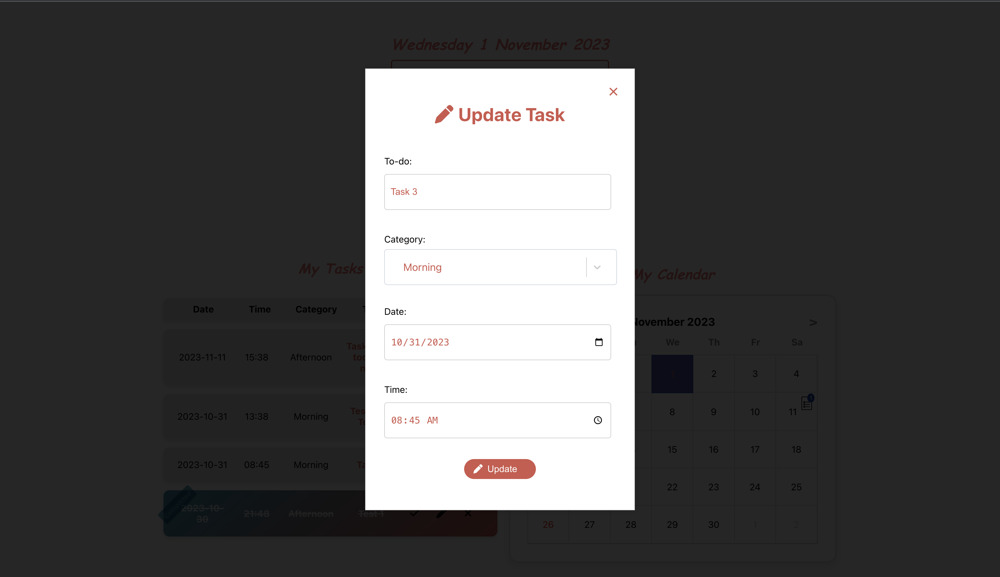
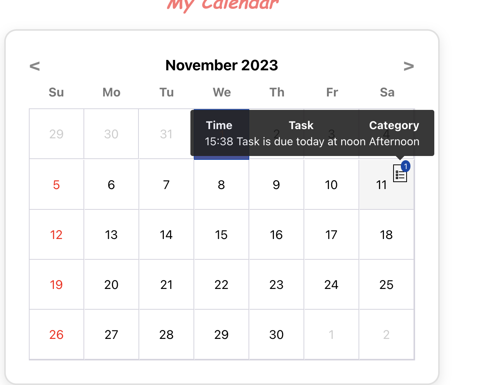
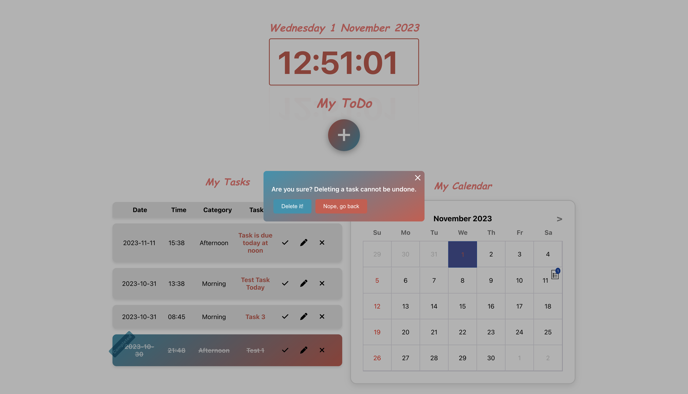

# Calendar ToDo Management

A React-based web application that provides a detailed view of tasks for any given date or week.

## Some Features

- **Calendar View**: Displays an overview of a month. Users can navigate through different months.
- **Task Display**: Shows tasks with their date, time, category, and content.
- **Editable Tasks**: Tasks can be edited directly from the list.
- **Deletable Tasks**: Tasks can be deleted with a confirmation popup for safety.
- **Task Completion Toggle**: Tasks can be marked as completed, and a badge shows up for completed tasks.
- **Load More**: Displays tasks in batches and provides a "Load More" button to load subsequent tasks.
- **Task Sorting**: Prioritizes tasks due today, then incomplete future tasks, past incomplete tasks, and finally completed tasks. Sorted further by date and time.
- **Popups & Overlays**: Interactive popups for task editing and deletion, with an overlay for improved UI experience.

## Screenshots for some features

## Available Scripts

In the project directory, you can run:

### `npm start`

Runs the app in the development mode.\
Open [http://localhost:3000](http://localhost:3000) to view it in your browser.

The page will reload when you make changes.\
You may also see any lint errors in the console.

### `npm test`

Launches the test runner in the interactive watch mode.\
See the section about [running tests](https://facebook.github.io/create-react-app/docs/running-tests) for more information.

### `npm run build`

Builds the app for production to the `build` folder.\
It correctly bundles React in production mode and optimizes the build for the best performance.

The build is minified and the filenames include the hashes.\
Your app is ready to be deployed!

See the section about [deployment](https://facebook.github.io/create-react-app/docs/deployment) for more information.

### `npm run eject`